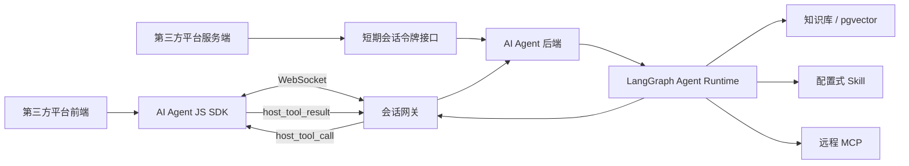

# AI Agent JS SDK 接入方案交接文档

## 1. 文档目的

本文整理多平台 AI Agent 的 JS SDK 构想，供另一个开发窗口继续调研、设计和实现。本文是第二阶段设计输入，不代表当前仓库已经实现 JS SDK 或 WebSocket。

当前后端第一阶段负责平台隔离、Agent 配置、知识库、Skill、MCP 和服务端对话能力。JS SDK 的职责是在其他平台网页中快速打开聊天窗口，并让 Agent 在授权后调用宿主网页注册的工具。

## 2. 产品目标

第三方平台引入一个 NPM 包或浏览器脚本后，可以：

1. 使用平台标识、Agent 标识和短期 token 连接指定 Agent。
2. 通过 SDK 打开、关闭或嵌入聊天窗口。
3. 通过 WebSocket 接收流式回答、引用、工具调用和确认事件。
4. 在宿主页面注册标准工具，例如打开页面、读取当前页面上下文、切换业务模块或填写表单。
5. 由后台为不同平台配置不同的知识库、Skill、MCP 和工具白名单。
6. 保证不同平台、Agent、会话和终端用户之间的数据隔离。

## 3. 核心使用场景

### 3.1 嵌入聊天窗口

接入方页面安装 SDK，初始化后显示悬浮入口或内嵌聊天面板。聊天 UI 由 SDK 提供，接入方可以配置主题、语言、位置和基础用户信息，但不能绕过后端权限边界。

### 3.2 Agent 调用宿主页面工具

接入方前端注册一个工具：

```ts
agent.registerTool({
  name: "open_order_page",
  description: "打开指定订单的详情页",
  inputSchema: {
    type: "object",
    properties: {
      orderId: { type: "string" },
    },
    required: ["orderId"],
    additionalProperties: false,
  },
  sideEffect: "navigation",
  execute: async ({ orderId }) => {
    window.location.assign(`/orders/${encodeURIComponent(orderId)}`)
    return { opened: true }
  },
})
```

Agent 决定调用该工具时，后端通过 WebSocket 向 SDK 发送工具调用请求。SDK 校验工具名称和参数，必要时向用户确认，然后在浏览器中执行并回传结构化结果。

### 3.3 平台级能力配置

后台可以为平台或 Agent 绑定：

- 一个或多个知识库；
- 配置式 Skill；
- 远程 MCP 服务及允许使用的工具；
- 宿主页面允许注册的工具名称；
- 工具副作用等级和确认策略。

## 4. 推荐总体架构



服务端 MCP 工具与浏览器宿主工具必须分开建模：MCP 工具在 Agent 后端执行；宿主工具在接入方浏览器执行。两者不能共用相同的信任级别和超时策略。

## 5. 鉴权方案

### 5.1 不推荐的方式

不应把平台长期 API Key 直接写进网页，然后使用“长期 token + platform_id”连接后端。网页中的凭据可被用户、浏览器插件、XSS 或构建产物读取。

### 5.2 推荐方式

1. 接入方服务端安全保存平台长期凭据。
2. 页面向接入方服务端申请 SDK 会话 token。
3. 接入方服务端调用 Agent 后端的 token exchange 接口。
4. Agent 后端签发短期 embed token，返回给浏览器。
5. SDK 使用 `embedToken + platformId + agentId` 建立 WebSocket。

短期 token 至少绑定：

- `platform_id`；
- `agent_id`；
- 接入方用户标识或匿名会话标识；
- 允许的 Origin；
- 允许注册的宿主工具名称；
- 过期时间和唯一 `jti`；
- 可选的最大会话数、消息数或消费额度。

建议 token 有效期为 5 至 15 分钟，WebSocket 建立后由服务端管理会话生命周期。需要支持服务端撤销、Origin 校验、限流和审计。

## 6. SDK 对外接口草案

```ts
import { createAgentClient } from "@ai-base/agent-sdk"

const agent = createAgentClient({
  endpoint: "https://agent.example.com",
  platformId: "platform_123",
  agentId: "agent_456",
  getToken: async () => {
    const response = await fetch("/api/agent-session", { method: "POST" })
    return (await response.json()).token
  },
  user: {
    id: "user_789",
    displayName: "Alice",
  },
  ui: {
    mode: "floating",
    position: "right",
    locale: "zh-CN",
    theme: "auto",
  },
})

agent.open()
agent.close()
agent.toggle()
agent.destroy()
agent.sendMessage("帮我查询最近的订单")
agent.registerTool(toolDefinition)
agent.unregisterTool("open_order_page")
agent.on("message", handler)
agent.on("connection_state", handler)
agent.on("error", handler)
```

建议同时提供三种 UI 模式：

- `headless`：只提供连接、消息和工具协议，UI 完全由接入方实现；
- `floating`：SDK 提供悬浮按钮和聊天抽屉；
- `embedded`：挂载到指定 DOM 容器。

第一版优先实现 `headless + floating`，避免一开始承担完整 UI 定制系统。

## 7. WebSocket 协议草案

连接地址示例：

```text
wss://agent.example.com/api/v1/ws?platform_id=platform_123&agent_id=agent_456
```

token 优先通过 WebSocket 子协议或首次认证消息传递，不建议放在 URL 查询参数中，避免进入代理日志和浏览器历史。

所有消息使用统一信封：

```json
{
  "id": "evt_123",
  "type": "message_delta",
  "conversationId": "conv_123",
  "requestId": "req_123",
  "timestamp": "2026-07-24T12:00:00Z",
  "payload": {}
}
```

客户端发送事件：

| 类型 | 用途 |
|---|---|
| `auth` | 连接建立后的 token 认证 |
| `message_send` | 发送用户消息 |
| `message_cancel` | 取消当前生成 |
| `host_tools_register` | 注册当前页面可用工具及 JSON Schema |
| `host_tool_result` | 回传宿主工具执行结果 |
| `host_tool_error` | 回传宿主工具执行失败 |
| `confirmation_resolve` | 用户批准或拒绝副作用操作 |
| `ping` | 应用层保活 |

服务端发送事件：

| 类型 | 用途 |
|---|---|
| `session_ready` | 鉴权完成并返回会话能力 |
| `message_started` | 回答开始 |
| `message_delta` | 增量文本 |
| `citation` | 知识库来源引用 |
| `tool_call` | 服务端 MCP 或内部工具调用状态 |
| `host_tool_call` | 请求 SDK 执行宿主工具 |
| `confirmation_required` | 请求用户确认副作用操作 |
| `tool_result` | 工具调用结果摘要 |
| `message_completed` | 回答完成和用量信息 |
| `error` | 结构化错误 |
| `pong` | 应用层保活响应 |

协议必须支持 `requestId/callId` 关联、重复事件去重、超时、取消、重连和断线续传。服务端应为每个会话保留有限事件游标，SDK 重连时提交最后收到的序号。

## 8. 宿主工具规范

每个工具至少包含：

```ts
type HostToolDefinition = {
  name: string
  description: string
  inputSchema: JsonSchema
  outputSchema?: JsonSchema
  sideEffect: "none" | "navigation" | "write" | "financial" | "external"
  timeoutMs?: number
  execute(input: unknown, context: ToolContext): Promise<unknown>
}
```

执行规则：

1. 后端只允许调用平台后台白名单中的工具。
2. SDK 只允许执行当前页面已经注册的工具。
3. 参数必须同时通过后端和 SDK 的 JSON Schema 校验。
4. `none` 类型可按平台策略自动执行。
5. `navigation`、`write`、`financial`、`external` 默认需要用户确认。
6. 每次调用记录平台、Agent、会话、用户、工具、参数摘要、确认结果、耗时和结果状态。
7. 工具结果必须限制大小并进行敏感字段过滤，不能把整个页面或业务对象无条件回传给模型。

“打开网页”不应允许 Agent 传入任意 URL。推荐注册业务语义工具，如 `open_order_page(orderId)`，由宿主代码生成受控地址。若确实提供 URL 工具，必须配置协议、域名和路径白名单。

## 9. 聊天窗口要求

聊天窗口应至少具备：

- 流式消息展示和停止生成；
- 新建、恢复和切换会话；
- 知识库引用查看；
- 工具调用状态和失败提示；
- 副作用操作确认；
- 连接中、重连中、离线和 token 失效状态；
- 输入禁用、重复提交防护和消息重试；
- 移动端适配、键盘操作和基础无障碍支持；
- 可配置主题，但不能允许接入方注入任意 HTML。

消息内容默认按纯文本或经过白名单过滤的 Markdown 渲染，禁止直接执行模型返回的 HTML、脚本或事件属性。

## 10. 后端需要新增的能力

JS SDK 开发前，Agent 后端需要补齐：

1. 平台接入凭据和短期 embed token 签发接口。
2. Origin 白名单、token 撤销、配额和限流。
3. WebSocket 会话网关和连接状态管理。
4. 会话、消息、事件游标和工具调用持久化。
5. Agent 与知识库、Skill、MCP、宿主工具白名单的发布快照。
6. 工具确认状态机、超时和审计日志。
7. WebSocket 与现有 HTTP/SSE 事件语义统一。
8. SDK 版本、协议版本和最低兼容版本管理。

## 11. 分期建议

### 第二阶段 A：连接与聊天

- headless SDK；
- 短期 token；
- WebSocket 鉴权、重连和流式消息；
- floating 聊天窗口；
- 会话与引用展示。

### 第二阶段 B：宿主工具

- 工具注册与 JSON Schema；
- `host_tool_call/result` 协议；
- 工具白名单；
- 副作用确认；
- 调用审计和超时。

### 第二阶段 C：生产增强

- 断线续传和多标签页协调；
- CDN/UMD 构建；
- React/Vue 包装组件；
- 主题和国际化；
- 指标、配额、错误追踪和兼容性治理。

## 12. 第一版明确不做

- 不允许 SDK 上传或执行任意 JavaScript 脚本作为 Skill。
- 不允许模型执行任意 `eval`、DOM 脚本或任意 URL 导航。
- 不在浏览器保存平台长期密钥。
- 不让浏览器直接连接数据库或内部 MCP 服务。
- 不在第一版实现复杂多 Agent 工作流、语音、文件编辑和离线推理。

## 13. 验收标准建议

- 两个平台使用不同 token 时，无法访问对方 Agent、会话和工具。
- token 过期、Origin 不匹配、Agent 不匹配时连接被拒绝。
- SDK 可以稳定打开聊天窗口、发送消息并接收流式回答和引用。
- WebSocket 短暂断开后可重连，不重复展示已确认事件。
- 未在后台白名单或未在页面注册的宿主工具不可调用。
- 有副作用的工具未经确认不会执行，拒绝后 Agent 能收到结构化结果。
- 工具参数和返回值通过 Schema 校验，超时和异常不会阻塞整个会话。
- 日志中不出现长期密钥、短期 token、模型密钥和未脱敏业务数据。
- SDK 销毁后移除事件监听、DOM 和连接，不产生内存泄漏。

## 14. 待下一窗口确认的问题

1. SDK 首发只支持现代浏览器，还是需要兼容旧版浏览器？
2. 首发包形态是 NPM ESM，还是同时提供 CDN/UMD？
3. 聊天 UI 首版需要 `floating`、`embedded` 还是两者都要？
4. embed token 由 Agent 后端直接签发，还是经过统一 API Gateway？
5. 匿名访客与已登录业务用户如何映射到会话身份？
6. 工具确认由 SDK 内置弹窗承载，还是允许宿主平台接管 UI？
7. 会话记录保存期限、删除机制和数据合规要求是什么？
8. 是否需要 React/Vue 专用包装包，还是只提供框架无关核心包？

## 15. 与当前项目的关系

当前 request `2026-07-23-configurable-agent-platform` 明确把 JS SDK 和 WebSocket 放在第一阶段范围之外。继续实现本方案时，应创建新的 Harness request，重新完成 `research -> spec -> plan`，重点调研 WebSocket 鉴权、断线恢复、浏览器工具安全和 SDK 版本兼容策略，并在涉及 API、数据模型和鉴权变化时等待人工确认。
