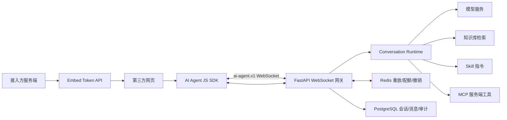
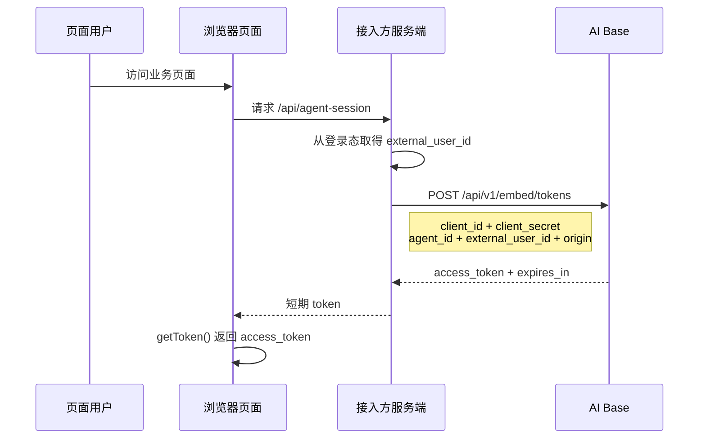
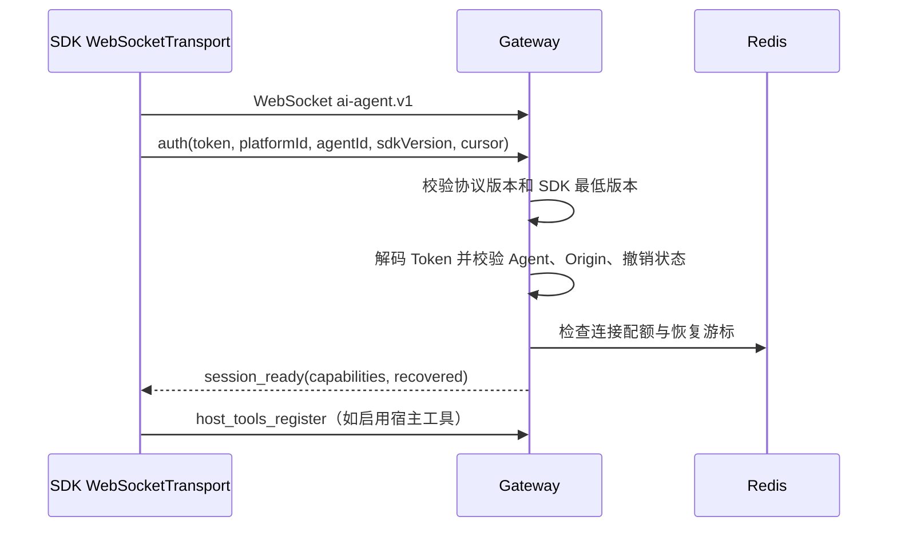
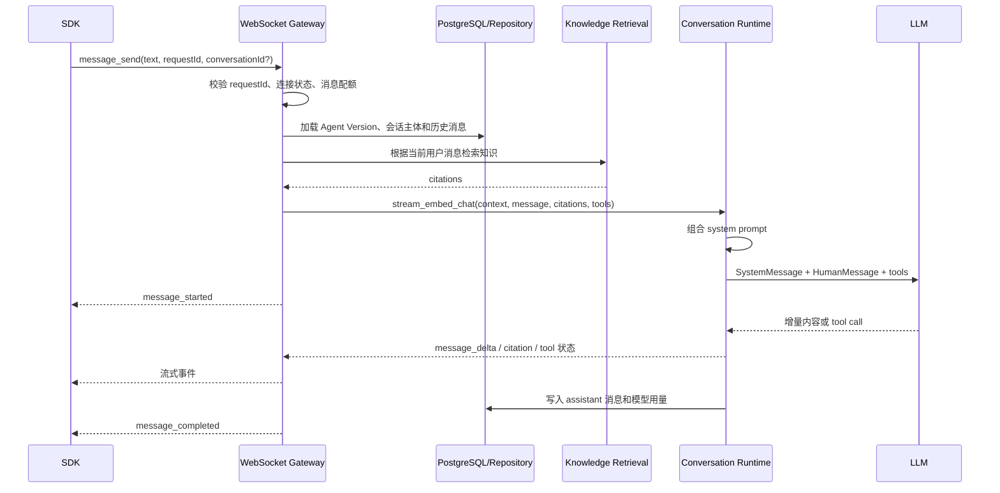
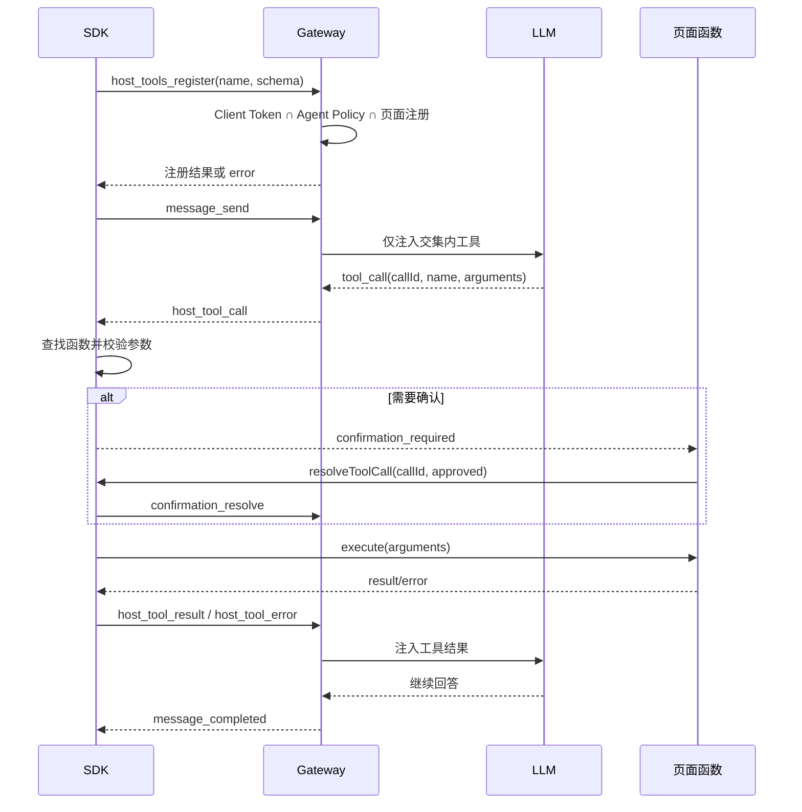
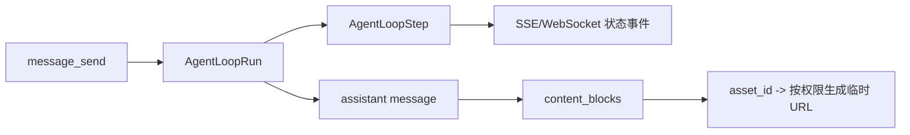

# AI Agent SDK 流程与变更指南

## 1. 文档定位

本文是 `apps/ai-sdk` 与后端 Agent 对话链路的长期维护基线。后续修改 SDK、WebSocket 协议、提示词、宿主工具或 Token 流程时，先对照本文确认所属阶段、边界、上下游契约和验证范围。

相关文档：

- SDK 使用：[agent-sdk-usage.md](../runbooks/agent-sdk-usage.md)
- 本地联调：[agent-sdk-local-integration.md](../runbooks/agent-sdk-local-integration.md)
- 第二阶段需求：[agent-sdk-phase-2-requirements.md](agent-sdk-phase-2-requirements.md)
- 宿主工具设计：[2026-07-28-agent-sdk-host-tools-design.md](../superpowers/specs/2026-07-28-agent-sdk-host-tools-design.md)

## 2. 总体边界



模块职责必须保持稳定：

| 模块 | 负责 | 不负责 |
|---|---|---|
| `apps/ai-sdk/src/core` | 浏览器连接、消息状态、工具注册和页面函数执行 | 保存长期密钥、决定后端权限、生成最终用户身份 |
| `embed` | Client 凭据校验、终端用户映射、短期 Token 签发 | 执行模型请求、执行页面 JavaScript |
| `gateway` | WebSocket 鉴权、连接状态、协议转换、取消、重放和工具协调 | 编写模型 Prompt 业务规则、直接执行页面函数 |
| `conversation` | Prompt 组合、模型调用、流式结果、消息持久化和用量记录 | 判断浏览器是否有权限注册工具 |
| `host_tool` | 工具策略、绑定、调用状态和审计 | 代替接入方页面执行函数 |

## 3. Token 与连接流程

### 3.1 Token Exchange



约束：

- `client_id`、`client_secret` 只能在接入方服务端使用。
- `external_user_id` 必须来自接入方服务端登录态或服务端生成的匿名会话。
- 浏览器不把 token 放在 URL、Local Storage 或普通日志中。
- Embed Token 绑定 `platform_id`、`agent_id`、`client_id`、Origin、终端用户和 TTL。

### 3.2 WebSocket Authentication



`auth` 成功前禁止处理 `message_send`、工具注册和其他业务消息。`session_ready` 之后才允许发送业务消息。

## 4. 一次 AI 对话流程



### 4.1 当前 Prompt 组成

当前后端 Prompt 顺序为：

```text
AgentVersion.system_prompt
+ Skill instruction_template
+ 知识库引用和引用规则
+ 当前连接已注册并授权的宿主工具说明
```

实现入口：

- 网关调用：[gateway/router.py](../../apps/backend/app/modules/gateway/router.py)
- 对话编排：[gateway/runtime.py](../../apps/backend/app/modules/gateway/runtime.py)
- Prompt 组合：[conversation/runtime.py](../../apps/backend/app/modules/conversation/runtime.py)
- 模型消息构造：[conversation/runtime.py](../../apps/backend/app/modules/conversation/runtime.py)

当前 SDK 的 `systemPrompt`、`setSystemPrompt()` 还只是本地状态，不会影响后端模型请求。后续接通时必须采用“后台基础 Prompt 始终保留，SDK Prompt 只能作为受限的会话级追加内容”，不得允许浏览器覆盖安全规则、工具授权规则或系统级约束。

## 5. 宿主工具流程



工具权限的最终决定在后端，SDK 只能执行当前页面已经注册的函数。任何工具注销、临时工具、策略变更都必须同时考虑：

1. SDK 本地 `ToolRegistry`；
2. 当前 WebSocket 连接的注册集合；
3. Token 中的工具范围；
4. Agent 和 Embed Client 后台策略；
5. 调用审计状态。

## 6. 协议事件基线

所有事件使用统一 envelope：

```json
{
  "id": "evt_123",
  "type": "message_delta",
  "protocolVersion": 1,
  "conversationId": "42",
  "requestId": "req_123",
  "sequence": 7,
  "timestamp": "2026-07-31T12:00:00Z",
  "payload": {}
}
```

主要客户端事件：

| 事件 | 用途 | 关键字段 |
|---|---|---|
| `auth` | 连接鉴权 | `token`、`platformId`、`agentId`、`sdkVersion`、恢复游标 |
| `message_send` | 发送用户消息 | `text`、`requestId`、可选 `conversationId` |
| `message_cancel` | 取消生成 | `requestId` |
| `host_tools_register` | 注册页面工具 | 工具名称、描述、JSON Schema |
| `host_tool_result` | 回传工具结果 | `callId`、`result` |
| `host_tool_error` | 回传工具错误 | `callId`、错误码、错误消息 |
| `confirmation_resolve` | 用户确认 | `callId`、`approved` |

主要服务端事件：

| 事件 | 用途 |
|---|---|
| `session_ready` | 鉴权成功、能力协商和恢复结果 |
| `message_started` | 模型请求开始 |
| `message_delta` | 流式文本片段 |
| `citation` | 知识库引用 |
| `host_tool_call` | 请求页面执行工具 |
| `confirmation_required` | 请求用户确认副作用操作 |
| `message_completed` | 最终文本、引用和用量 |
| `error` | 稳定错误码和是否可重试 |

新增字段必须保持向后兼容；改变既有字段含义、必填性、错误码或事件顺序时，必须更新协议测试和兼容性矩阵。

## 7. 后续修改规则

### 7.1 修改前先判断影响面

| 修改内容 | 必须同步检查 | 是否需要人工确认 |
|---|---|---|
| SDK 本地状态或 UI | SDK 单测、构建、Demo | 通常不需要 |
| `getToken`、Token claims、Origin | Embed、Gateway、鉴权测试和安全文档 | 需要 |
| WebSocket 事件或字段 | SDK/后端协议测试、兼容性矩阵、联调手册 | 需要 |
| Prompt 组合 | Agent Runtime、Skill、知识库、工具调用测试 | 若改变权限或安全规则则需要 |
| 工具注册/注销 | SDK Registry、Gateway 连接状态、策略和审计 | 需要 |
| Conversation 主体或消息模型 | 数据库模型、迁移、仓储、会话测试 | 需要 |
| 配额、重放、撤销 | Redis、故障降级、指标和网关测试 | 通常需要 |

### 7.2 每次修改必须留下的证据

1. 在对应 Harness request 的 `spec.md` 增加变更记录。
2. 如果改变方案或增加外部依赖，更新 `research.md`。
3. 在 `plan.md` 写明变更文件、数据流、测试和回滚方式。
4. 遵循先写失败测试，再写实现。
5. 在 `verify.md` 记录真实命令、预期、实际结果和例外。
6. 在 `acceptance.md` 对验收标准逐项结论化。

### 7.3 最小验证命令

SDK 修改：

```bash
cd apps/ai-sdk
npm run test -- --run
npm run type-check
npm run build
```

后端网关、Embed 或对话修改：

```bash
cd apps/backend
poetry run pytest tests/embed tests/gateway tests/conversation -q
```

跨端协议修改还必须执行：

```bash
git diff --check
```

## 8. AgentLoop 与消息内容块

一次 `message_send` 对应一个 `AgentLoopRun`，最终助手消息通过 `assistant_message_id` 关联该运行。消息本身保存兼容的纯文本 `content` 和可恢复的 `content_blocks`；图片、文件内容块保存稳定的资源 ID，读取时再按权限生成临时访问地址。

AgentLoop 步骤保存面向用户的安全摘要和必要审计字段，常见步骤包括知识库检索、技能指令、技能工具、宿主工具、MCP 工具、模型生成、handoff 和 guardrail。模型思考内容（reasoning/thinking）经用户确认后落库到 `agent_loop_steps.thinking_text`，与正文严格分离；完整 system prompt、密钥、Token 和未脱敏敏感参数不落库。工具步骤的 `input_summary` / `output_summary` 只保存脱敏截断的参数与结果摘要。`langchain-openai` 的 `ChatOpenAI` 只按官方 OpenAI 规范解析响应，会丢弃 DeepSeek/GLM 等厂商的 `reasoning_content` 字段；模型工厂统一使用 `ProviderThinkingChatOpenAI` 子类，在流式 delta 与完整 message 两个解析入口把 `reasoning_content`/`reasoning`/`reasoning_details` 归一化补回 `additional_kwargs`，`stream_graph` 再从中实时提取并落库。

实时协议保留既有消息和工具事件，并增加 `agent_loop_started`、`agent_step_started`、`agent_step_delta`、`agent_step_completed`、`agent_loop_completed`。`agent_step_delta` 用于步骤过程增量（第一版承载思考内容，payload 含 `stepId`、`stepType`、`field`、`content`）；步骤事件兼容性携带 `inputSummary`、`outputSummary`、`thinkingText`，引用对象携带 `knowledgeBase`。旧 SDK 遇到未知事件时忽略该事件，继续消费兼容的消息事件。聊天前端按事件到达顺序内联渲染正文片段与步骤卡片，历史消息无时间线时降级为“过程在上、正文在下”的折叠面板。



## 9. 当前明确未完成项

- SDK `systemPrompt` 尚未进入后端 Prompt 组合链路。
- SDK `unregisterTool()` 和 `clearCustomTools()` 尚未完整同步当前 WebSocket 注册集合。
- 真实第三方平台 Token Proxy 和浏览器联调仍需接入方环境验证。

这些项目完成前，不应在 README 或验收文档中描述为“完整支持”。
