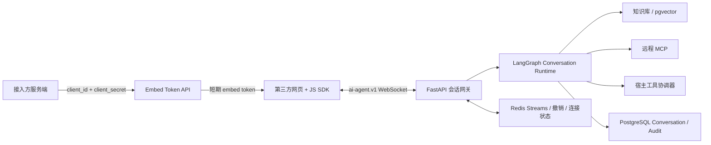

# AI Agent JS SDK 第二阶段完整需求

## 1. 文档定位

本文是多平台可配置 AI Agent 第二阶段的产品与技术需求总纲，覆盖嵌入式鉴权、WebSocket 会话网关、JS SDK 真实接入、宿主页面工具和生产治理。本文供不同开发窗口共同使用，不依赖聊天上下文。

第一阶段后端已经在 `main` 完成：平台隔离、Agent 版本、知识库、配置式 Skill、远程 MCP、工具确认审计、Conversation 持久化以及 HTTP JSON/SSE 对话。当前 `apps/ai-sdk` 已有 API、Vue UI 和构建骨架，但 WebSocket 是 Mock，SSE 是占位实现，尚未连接后端。

第二阶段采用“完整需求统一定义、独立 request 分段交付”的方式推进：

1. Phase 2A：短期令牌、WebSocket 网关、真实聊天与 SDK 接入。
2. Phase 2B：宿主页面工具注册、白名单、确认、执行与审计。
3. Phase 2C：断线增强、配额、可观测性、兼容性和发布治理。
4. Phase 2D：管理后台页面，配置平台 Agent、知识库、Skill、MCP、Embed Client 和宿主工具策略。

当前首个可执行 request 为 `2026-07-26-agent-sdk-websocket-foundation`，只实施 Phase 2A。

## 2. 产品目标

第三方平台只需安装 NPM 包或加载浏览器构建产物，即可在网页中使用指定 Agent：

- 接入方服务端使用长期凭据换取短期 embed token，浏览器不接触长期密钥。
- SDK 使用 token 连接后端 WebSocket，发送消息并接收流式回答、引用和工具状态。
- SDK 支持 `headless`、`floating` 和后续 `embedded` 模式。
- 平台管理员可限定允许嵌入的 Origin、Agent 和宿主工具。
- Agent 可以调用服务端 MCP，也可以在严格授权后请求浏览器执行宿主工具。
- 平台、Agent、最终用户、会话和工具调用保持可验证的数据隔离。

## 3. 用户与角色

| 角色 | 职责 |
|---|---|
| 平台管理员 | 配置 Agent 能力、Embed Client、Origin、宿主工具策略和审计查询权限 |
| 接入方服务端 | 安全保存 Embed Client 密钥，为页面最终用户申请短期 token |
| 页面最终用户 | 通过 SDK 与 Agent 对话，并确认或拒绝有副作用的操作 |
| 宿主页面 | 注册当前页面真实可执行的业务语义工具 |
| Agent 后端 | 验证 token、隔离数据、运行 Agent、协调服务端工具和宿主工具 |

## 4. 核心原则

1. `platformId`、`agentId` 和浏览器提交的用户信息不能单独构成授权依据，授权只来自已验证 token claims 和服务端绑定关系。
2. 浏览器不能持有平台长期密钥、模型密钥或 MCP 密钥。
3. MCP 工具与宿主页面工具分开建模、分开执行、分开审计。
4. 不允许 Agent 执行任意 JavaScript、`eval`、任意 DOM 操作或任意 URL 导航。
5. 协议事件必须可关联、去重、取消和有限重放。
6. 数据库保存业务事实，Redis 保存有期限的连接状态、撤销标记和事件重放窗口。
7. 每个阶段都形成独立 Harness request、验证证据和可回滚 checkpoint。

## 5. 总体架构



WebSocket 网关第一版继续部署在 FastAPI 应用内，复用现有鉴权、仓储和运行时。协议与连接管理保持独立模块，以便连接规模需要时拆成独立网关，不在 Phase 2A 提前拆服务。

## 6. 身份与鉴权需求

### 6.1 Embed Client

平台管理员创建 Embed Client 时，系统生成 `client_id` 和只展示一次的 `client_secret`。数据库只保存密钥哈希。每个 Client 配置：

- 所属平台；
- 启用状态；
- 允许的 Origin 精确白名单；
- 允许访问的 Agent；
- token TTL，默认 10 分钟，允许范围 5 至 15 分钟；
- 可选每分钟 token 数和并发连接限制。

### 6.2 最终用户身份

新增平台最终用户实体，以 `(platform_id, external_user_id)` 唯一映射接入方用户。内部后台用户继续使用 `sys_users`，嵌入用户不创建伪后台账号。

Conversation 支持且只支持一种主体：内部 `user_id` 或外部 `platform_end_user_id`。迁移必须保留现有内部会话，并添加数据库级互斥约束。

### 6.3 Token Exchange

接入方服务端调用 `POST /api/v1/embed/tokens`，通过 Client 凭据申请 token。请求包含 `agent_id`、`external_user_id`、可选展示名和可选宿主工具声明摘要。

embed token 至少包含：

- `iss=ai-base`；
- `aud=agent-embed`；
- `sub=platform_end_user_id`；
- `platform_id`、`agent_id`、`client_id`；
- `origin` 或允许 Origin 集合摘要；
- `jti`、`iat`、`nbf`、`exp`；
- `protocol_version=1`；
- 允许的宿主工具名称，Phase 2B 启用。

服务端固定允许的签名算法，并校验 issuer、audience、有效期、jti、Client/Agent 状态和 Origin。embed token 与后台 access token 使用不同 audience 和验证入口。

### 6.4 WebSocket 认证

连接地址固定为：

```text
wss://agent.example.com/api/v1/ws/agents/{agent_id}
```

浏览器原生 WebSocket 无法设置任意 `Authorization` 请求头，因此 token 不放 URL。握手时先验证 `Origin` 和子协议 `ai-agent.v1`，连接建立后客户端必须在 5 秒内发送 `auth` 事件。认证成功前不接收业务事件，失败后使用稳定 close code 关闭。

## 7. 协议需求

### 7.1 统一信封

线协议使用 camelCase，事件类型使用 snake_case：

```json
{
  "id": "evt_01J...",
  "type": "message_delta",
  "protocolVersion": 1,
  "conversationId": "123",
  "requestId": "req_01J...",
  "sequence": 42,
  "timestamp": "2026-07-26T12:00:00Z",
  "payload": {}
}
```

`id`、`requestId` 使用不可预测的 ULID/UUID；`sequence` 在会话事件流内单调递增。未知可选字段必须忽略，未知协议主版本必须拒绝。

### 7.2 客户端事件

| 类型 | 阶段 | 说明 |
|---|---|---|
| `auth` | 2A | 提交短期 token、SDK 版本和最后事件游标 |
| `message_send` | 2A | 发送文本及可选 conversationId |
| `message_cancel` | 2A | 取消 requestId 对应生成 |
| `ping` | 2A | 应用层保活 |
| `host_tools_register` | 2B | 注册当前页面工具及 Schema |
| `host_tool_result` | 2B | 回传工具结果 |
| `host_tool_error` | 2B | 回传工具错误 |
| `confirmation_resolve` | 2B | 批准或拒绝副作用操作 |

### 7.3 服务端事件

| 类型 | 阶段 | 说明 |
|---|---|---|
| `session_ready` | 2A | 返回会话主体、协议能力和恢复结果 |
| `message_started` | 2A | 回答开始 |
| `message_delta` | 2A | 增量文本，payload 字段为 `content` |
| `citation` | 2A | 知识库引用 |
| `message_completed` | 2A | 最终内容、grounded 状态和引用 |
| `error` | 2A | 结构化错误，包含稳定 code 和 retryable |
| `pong` | 2A | 保活响应 |
| `tool_call`、`tool_result` | 2A | 服务端 MCP 状态 |
| `host_tool_call` | 2B | 请求浏览器执行宿主工具 |
| `confirmation_required` | 2B | 请求最终用户确认 |

### 7.4 恢复与幂等

- 服务端将可重放事件写入 Redis Stream，按会话保留 15 分钟并限制最大条数。
- SDK 保存最后确认的事件 ID/sequence，重连 `auth` 时提交游标。
- 游标仍在窗口内时补发缺失事件；无法恢复时返回 `session_ready.recovered=false`，SDK 重新拉取持久化消息快照。
- `message_send` 必须带客户端 `requestId`；服务端对同一主体和 requestId 幂等，避免重连重复生成。
- 取消后不得继续调用工具或写入新的 assistant 完成消息；已持久化的部分状态按明确策略保留。

## 8. Phase 2A：连接与聊天

### 8.1 后端

- Embed Client 管理、密钥轮换和 Agent 绑定 API。
- 平台最终用户映射和 Conversation 主体扩展。
- token exchange、token 撤销和独立 JWT 校验。
- WebSocket 认证、连接生命周期、消息大小限制、速率限制和心跳。
- 复用现有 Conversation Runtime，输出与 HTTP/SSE 一致的语义事件。
- Redis Streams 有限重放，单实例和多实例均使用同一抽象。
- 持久化会话消息快照查询接口，供恢复失败时使用。

### 8.2 SDK

- 将 Mock WebSocket 替换为真实浏览器 WebSocket。
- `getToken()` 只在连接/刷新时调用，token 不写入日志、URL、localStorage 或消息记录。
- 支持连接状态、指数退避加抖动、游标恢复、token 失效刷新和显式销毁。
- 将当前 `text_delta` 统一为 `message_delta`，完整处理 citation、tool 状态、completed 和 error。
- 支持 `headless` 与 `floating`；`embedded` 在 2C 前不作为验收阻塞项。
- 增加 Vitest 单元测试和可连接本地 FastAPI 的端到端示例。

## 9. Phase 2B：宿主页面工具

### 9.1 工具策略

后台保存宿主工具策略：名称、描述约束、JSON Schema、sideEffect、是否启用、确认策略和允许 Agent。浏览器注册只表示当前页面具备执行能力，不能扩大后台白名单。

工具可调用集合为：

```text
token 允许工具 ∩ Agent 发布策略 ∩ 当前页面已注册工具
```

### 9.2 执行规则

- 后端和 SDK 都使用 JSON Schema Draft 2020-12 验证参数。
- `none` 可按平台策略自动执行；`navigation`、`write`、`financial`、`external` 默认确认。
- 每次调用使用唯一 callId，状态机为 `requested -> awaiting_confirmation -> running -> succeeded|failed|rejected|expired`。
- SDK 执行有超时、AbortSignal、结果大小限制和敏感字段过滤。
- 工具断线时不盲目重试有副作用执行；服务端根据 callId 查询最终状态。
- 宿主工具调用单独审计，不复用 MCP 审计表。

## 10. Phase 2C：生产增强

- Client、平台、Agent 和最终用户维度的连接数、消息数、token 签发和模型消费配额。
- 网关连接、认证失败、重连、恢复成功率、消息延迟、工具耗时和错误率指标。
- SDK 协议版本、最低后端版本、弃用窗口和兼容性矩阵。
- ESM 为主，补 CDN/UMD；React/Vue 包装层基于真实需求另建包。
- 多标签页连接协调、离线状态、可访问性、国际化和主题治理。
- 会话保留期、删除、导出和数据合规策略。

## 11. Phase 2D：管理后台

管理后台提供平台范围内的 Agent、知识库、Skill、MCP、Embed Client、Origin、宿主工具策略和审计配置页面。前端只调用已验收的管理 API，不在 Phase 2A 同时开发，以免协议与管理交互互相阻塞。

## 12. 安全要求

- 生产环境只允许 WSS。
- WebSocket 握手必须使用 Origin 精确白名单，不支持通配符子串匹配。
- 每条业务消息重新检查主体、Agent 和资源关系，不能只依赖握手成功。
- 单消息默认上限 64 KiB，工具结果默认上限 32 KiB，超限返回稳定错误。
- 限制认证超时、空闲时长、并发连接、消息频率和未完成请求数。
- 默认关闭 WebSocket 压缩；确有性能证据后再单独评估。
- 日志不记录 token、Client secret、模型密钥、MCP 密钥和未脱敏工具参数。
- Markdown 使用白名单渲染，禁止模型 HTML、脚本、事件属性和危险 URL。

## 13. 非目标

- 不执行上传 JavaScript、Python 脚本或任意 Skill 代码。
- 不允许浏览器直连数据库、Redis、MCP 或模型供应商。
- 不在第二阶段引入复杂多 Agent 编排、语音、视频和离线模型。
- 不为了 WebSocket 单独拆微服务，除非压测证明现有部署边界不足。
- 不承诺服务重启后无限期补发所有流式 delta；持久消息才是长期事实来源。

## 14. 总体验收标准

- 两个平台、两个 Agent 和两个最终用户不能访问彼此 token、连接、会话、引用或工具。
- 长期 Client secret 不进入浏览器；短期 token 过期、Origin/Agent/audience 不匹配时拒绝连接。
- SDK 可以真实连接后端，完成流式聊天、引用展示、取消和短断线恢复。
- 无法恢复事件流时，SDK 可从持久化消息恢复一致视图，不重复显示完成事件。
- 未经后台允许或页面未注册的宿主工具永远不可执行。
- 有副作用工具未经确认不执行，重复结果不会导致重复副作用。
- 所有阶段均有单元、集成、安全和端到端验证证据，并更新 Harness acceptance。

## 15. Request 与提交策略

每个阶段使用永久 worktree 和独立分支，每个稳定任务提交 checkpoint。推荐顺序：

1. `2026-07-26-agent-sdk-websocket-foundation`：Phase 2A。
2. `agent-sdk-host-tools`：Phase 2B，待 2A 验收后创建。
3. `agent-sdk-production-hardening`：Phase 2C，待真实压测与接入反馈后创建。
4. `agent-platform-admin-console`：Phase 2D，待管理 API 稳定后创建。

涉及架构、数据模型、API 和鉴权变更，Phase 2A 在进入实现前必须获得人工确认。
