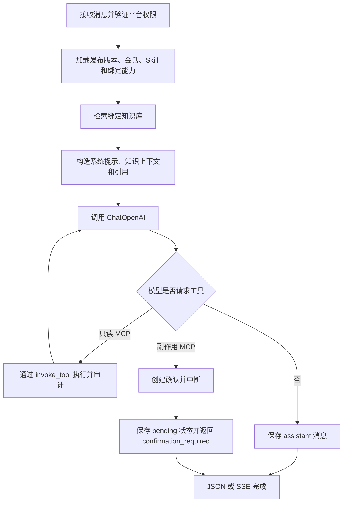

# 任务 6 新窗口交接：LangGraph 对话、引用与 SSE

## 1. 当前工作位置

- 根仓库：`/Users/lixingwen/xw/study/ai-base`
- 持久化 worktree：`/Users/lixingwen/xw/study/ai-base/.worktrees/configurable-agent-platform`
- 分支：`codex/configurable-agent-platform-rebuild`
- 任务 5 功能基线：`d2cea4b feat(agent): add remote MCP tools and confirmations`
- 实际开发基线：以新窗口打开时该分支的当前 HEAD 为准，交接文档提交位于 `d2cea4b` 之后。
- Harness request：`docs/harness/requests/2026-07-23-configurable-agent-platform/`
- 当前 Harness 状态：`phase=implement`、`status=active`

必须继续使用上述持久化 worktree，不要创建 `/private/tmp` worktree。每完成一个稳定阶段都提交 checkpoint。

## 2. 已完成范围

任务 0 至任务 5 已完成并提交：

1. Agent 运行依赖和配置；
2. 平台与平台管理员隔离；
3. Agent 草稿、不可变版本、发布和回滚；
4. 文件/网页知识库、LlamaIndex 切片、embedding、pgvector 检索和引用；
5. 配置式 Skill 与 Agent 绑定；
6. 远程 Streamable HTTP MCP、工具同步、白名单、副作用确认和审计。

最近验证结果：

- `poetry run pytest -q`：`80 passed`；
- `poetry run ruff check .`：通过；
- MCP 定向 Black：通过；
- Alembic history head：`20260725_0007`；
- MCP OpenAPI 路径：7 个。

关键提交：

| 提交 | 内容 |
|---|---|
| `c25e790` | Agent 配置与版本 |
| `7915944` | 知识库数据基础 |
| `3ffeeb0` | 异步知识导入和检索 |
| `afb1ce6` | 配置式 Skill 和绑定 |
| `d2cea4b` | 远程 MCP、确认和审计 |

## 3. 任务 6 目标

实现第一阶段真正可调用的 Agent 对话后端：

- 使用 LangGraph 编排对话流程；
- 使用 Agent 当前已发布版本构造聊天模型；
- 读取 Agent 绑定的知识库并返回来源引用；
- 将启用的 Skill 指令合并到运行时上下文；
- 暴露 Agent 已绑定且在白名单内的 MCP 工具；
- 只读工具可自动执行；
- 有副作用工具返回 `confirmation_required`，不得自动执行；
- 同时提供普通 JSON 和 SSE 流式响应；
- 保存 Conversation、Message 和必要的运行状态；
- 无充分知识库依据时允许通用模型回答，但必须标记为非知识库内容。

第一阶段仍不实现：

- JS SDK；
- WebSocket；
- 管理后台页面；
- 浏览器宿主工具；
- 脚本 Skill；
- 本地 `stdio` MCP；
- 复杂多 Agent 工作流。

## 4. 已确认 API 和事件契约

原 spec 约定对话入口：

```text
POST /api/v1/agents/{agent_id}/chat
```

建议请求体：

```json
{
  "message": "退款规则是什么？",
  "conversation_id": null,
  "stream": true
}
```

普通 JSON 至少返回：

```json
{
  "conversation_id": 1,
  "message_id": 2,
  "content": "...",
  "citations": [],
  "knowledge_grounded": true,
  "pending_confirmation_id": null
}
```

SSE 事件名称已经在 spec 中确认：

- `message_delta`
- `citation`
- `tool_call`
- `confirmation_required`
- `tool_result`
- `message_completed`
- `error`

推荐统一事件信封：

```json
{
  "type": "message_delta",
  "conversation_id": 1,
  "message_id": 2,
  "sequence": 3,
  "payload": {}
}
```

SSE 必须满足：

- `Content-Type: text/event-stream`；
- 每条事件包含递增 `sequence`；
- 客户端断开后停止模型生成和无意义的工具调用；
- 流结束前发送 `message_completed`；
- 业务错误发送结构化 `error`，日志中不暴露密钥。

若准备改变路径、请求体、事件名或确认流程，属于 API 契约变化，必须先更新 spec 并等待用户确认。

## 5. 当前代码可复用入口

### Agent

- `apps/backend/app/modules/agent/models.py`
- `apps/backend/app/modules/agent/repositories.py`
- `apps/backend/app/modules/agent/services.py`
- `build_chat_model(version)` 已能从加密配置构造 `ChatOpenAI`。
- `Agent.default_version_id` 指向当前发布版本。

任务 6 需要补仓储方法：按 `agent_id + 当前用户平台权限` 读取 Agent 和默认版本。

### 知识库

- `apps/backend/app/modules/knowledge/repositories.py`
- `apps/backend/app/modules/knowledge/runtime.py`
- `apps/backend/app/modules/knowledge/services.py`
- 已有 embedding 模型构造、维度校验、pgvector 相似度查询和 Citation Schema。

当前缺口：还没有 `AgentKnowledgeBase` 绑定模型。任务 6 需要新增绑定，避免 Agent 任意检索平台内所有知识库。

### Skill

- `apps/backend/app/modules/skill/models.py`
- `apps/backend/app/modules/skill/services.py`
- 已有 `AgentSkill` 绑定和安全模板渲染。

当前缺口：仓储还没有“按 Agent 获取已启用 Skill，并按 `sort_order` 排序”的方法。

### MCP

- `apps/backend/app/modules/mcp/runtime.py`
- `apps/backend/app/modules/mcp/repositories.py`
- `apps/backend/app/modules/mcp/services.py`
- 已有官方 Streamable HTTP 客户端、工具白名单、参数 Schema 校验、副作用确认、10 分钟过期、原子领取和审计。

任务 6 不应绕过 `invoke_tool()` 直接调用 MCP。所有工具调用必须继续经过当前策略服务。

## 6. 推荐新增数据模型

建议迁移编号：`20260725_0008_conversation.py`。

至少包含：

### AgentKnowledgeBase

- `agent_id`
- `knowledge_base_id`
- `is_enabled`
- `sort_order`
- 唯一约束：`agent_id + knowledge_base_id`

绑定时必须验证 Agent 和知识库属于同一平台。

### Conversation

- `id`
- `platform_id`
- `agent_id`
- `user_id`
- `title`
- `status`
- `created_at`
- `updated_at`

### ConversationMessage

- `id`
- `conversation_id`
- `role`：`user | assistant | tool`
- `content`
- `citations` JSON
- `knowledge_grounded`
- `tool_call_id` 或工具调用摘要
- `created_at`

如果采用 LangGraph checkpointer 并新增 checkpoint 表或依赖，先补充调研和 plan。不要同时手写一套与 LangGraph checkpoint 语义冲突的状态存储。

## 7. 推荐 LangGraph 流程



建议 LangGraph State 至少包含：

- `platform_id`
- `agent_id`
- `user_id`
- `conversation_id`
- `messages`
- `retrieved_chunks`
- `citations`
- `knowledge_grounded`
- `tool_events`
- `pending_confirmation_id`

不要在 State 或普通日志中保存模型密钥、MCP 认证头和知识库 embedding 密钥。

## 8. 知识库回答规则

1. 只检索 Agent 已绑定且启用的知识库。
2. 检索结果必须带文档标题、来源 URL 和命中片段。
3. 有检索依据时设置 `knowledge_grounded=true`。
4. 无足够依据时允许模型使用通用知识回答，但必须设置 `knowledge_grounded=false`，且不能伪造引用。
5. 引用应作为结构化字段和 SSE `citation` 事件返回，不只拼进自然语言正文。
6. 第一版阈值可以配置为明确常量，但需测试“有依据”和“无依据”两条路径。

## 9. Skill 运行规则

- 只加载 Agent 已绑定、启用且平台一致的 Skill。
- 按 `sort_order` 组合 Skill 指令。
- Skill 仍是声明式模板，不执行脚本。
- 参数缺失时使用现有 `BadRequestException` 语义，不静默插入空值。
- Skill 生命周期钩子首期只作为元数据；除非 spec 已明确，不扩展成任意代码执行。

## 10. MCP 与人工确认规则

- 只把 Agent 已绑定 Server 中 `is_allowed=true` 的工具暴露给模型。
- 工具参数必须经过服务端 JSON Schema 校验。
- `side_effect=none` 才允许自动调用。
- `navigation/write/financial/external` 必须返回 `confirmation_required`。
- 不允许 LangGraph 节点绕过 `app.modules.mcp.services.invoke_tool()`。
- 确认批准通过现有 `/mcp-confirmations/{id}/resolve` API；若任务 6 需要自动恢复 Graph，先明确 checkpoint 和恢复协议。
- 工具结果进入下一轮模型前必须限制大小，避免 MCP 返回超大内容撑爆上下文。

## 11. 推荐实现顺序

严格使用测试驱动，每个行为先看到失败测试：

1. 新增 Conversation、Message、AgentKnowledgeBase 失败测试和迁移。
2. 新增平台隔离和 Agent/知识库同平台绑定测试。
3. 新增运行时能力加载器：发布版本、Skill、知识库、MCP 工具。
4. 新增知识检索节点及引用/grounded 测试。
5. 新增 LangGraph 最小图：无工具普通回答。
6. 新增只读 MCP 调用路径。
7. 新增副作用 MCP `confirmation_required` 路径。
8. 新增 JSON 对话 API。
9. 新增 SSE 事件顺序、完成和错误测试。
10. 执行全量验证、更新 Harness、提交 checkpoint。

建议至少覆盖：

- 未发布 Agent 拒绝对话；
- 非所属平台用户无法访问 Agent；
- 不能检索未绑定知识库；
- Skill 按顺序进入 system prompt；
- 有引用与无引用回答；
- MCP 未绑定或未启用工具不可调用；
- 副作用工具不会自动执行；
- SSE 事件顺序稳定；
- 客户端取消后停止生成；
- 会话不能跨平台或跨用户读取。

## 12. 验证命令

```bash
cd /Users/lixingwen/xw/study/ai-base/.worktrees/configurable-agent-platform/apps/backend
poetry run pytest -q
poetry run ruff check .
poetry run black --check app/modules/conversation tests/conversation migrations/versions/20260725_0008_conversation.py
poetry check
poetry run alembic history
```

全仓 `poetry run black --check .` 当前会因 33 个历史文件失败。不要为了任务 6 格式化无关文件；新增文件必须通过定向 Black。

## 13. 已知环境问题

- 本机 PostgreSQL 与 Redis 容器在运行。
- worktree 默认数据库密码与现有 PostgreSQL 容器不一致，`poetry run alembic current` 返回 `InvalidPasswordError`。
- 在没有正确 `DATABASE_URL` 前，不得声称 `alembic upgrade head` 已通过。
- 当前没有真实远程 MCP 测试服务；MCP 官方客户端目前使用注入会话测试验证。
- 当前没有可用 OpenAI/embedding 测试密钥；单元测试应通过依赖注入使用确定性 fake model 和 fake embedding，不调用真实计费 API。

## 14. Harness 要求

- 继续复用 request：`2026-07-23-configurable-agent-platform`。
- 不新建临时 request，也不新建临时 worktree。
- 当前任务已处于原 spec 范围，既有架构、数据模型、API 和权限方案已获得用户确认。
- 如果改变对话 API、事件契约、权限语义或引入新的 checkpoint 架构，必须先更新 `research.md/spec.md/plan.md` 并等待用户确认。
- 完成后更新 `plan.md`、`verify.md`、`acceptance.md` 和 `meta.json`。
- 每个稳定阶段创建永久 Git checkpoint。

## 15. 可直接发送给新窗口的指令

```text
继续实现 Harness request：2026-07-23-configurable-agent-platform 的任务 6。

必须在持久化 worktree 工作：
/Users/lixingwen/xw/study/ai-base/.worktrees/configurable-agent-platform

当前分支：codex/configurable-agent-platform-rebuild
任务 5 功能基线：d2cea4b；实际开发以当前 HEAD 为准。

先完整阅读：
1. AGENTS.md
2. docs/harness/README.md
3. docs/harness/policies/global.md
4. docs/harness/backend.md
5. docs/harness/requests/2026-07-23-configurable-agent-platform/{research,spec,plan,verify,acceptance}.md
6. docs/handoff/task-6-langgraph-chat-sse.md

目标：实现 LangGraph 对话流程、Agent 绑定知识库、Conversation/Message 持久化、知识库引用、Skill 指令加载、MCP 工具调用与人工确认衔接，以及 HTTP JSON/SSE 对话接口。

要求：
- 使用成熟库和现有模块，不重复实现 LangGraph/LlamaIndex/MCP 核心能力。
- 严格测试驱动，先看到失败测试再写实现。
- 不实现 JS SDK、WebSocket、脚本 Skill 或本地 stdio MCP。
- 不绕过平台隔离、MCP 白名单和副作用确认。
- 不使用 /private/tmp worktree。
- 每个稳定阶段提交永久 checkpoint。
- 未拿到正确 DATABASE_URL 时，不得宣称真实迁移通过。

先核对当前 git status 和基线测试，再给出任务 6 的实施切分，然后连续推进实现和验证。
```
